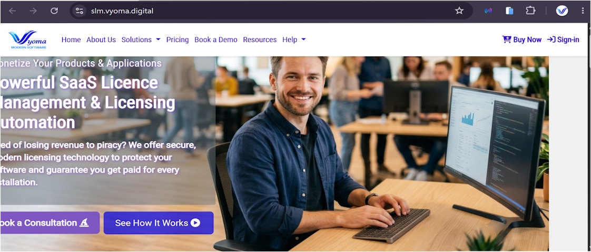

# Vyoma-SLM-license-guard-templates
This repository guides users on ways to integrate Vyoma SaaS Licence Manager's Guard Client with their Products  or Applications
---
<p>
  Please sponsor this project. It is a developer template for configuring product security guards on-premise or in the cloud, associated with <a href="https://slm.vyoma.digital" target="_blank" rel="noopener noreferrer">Vyoma SLM</a>
</p>

<a href="https://razorpay.me/@yogsystems?amount=zgioswZa9n4qt5x9yD7i%2BQ%3D%3D" target="_blank" rel="noopener noreferrer">
  
</a>

---
# Vyoma SLM License Guard Integration Templates

Welcome to the official code templates and integration guide for **Vyoma SaaS License Manager (SLM) Guard Client**. This repository provides starter code, API request samples, and integration patterns to help software vendors easily connect their applications and products to the Vyoma SLM Guard Client.

---


---

## 🚀 Quick Overview

Vyoma SLM safeguards your applications through a 4-stage activation lifecycle and offers two primary enforcement modes:

1. **Proxy Mode (Zero Integration):** The Guard Client runs on your server, acting as a reverse proxy that automatically validates licenses on incoming web requests before routing them to your app.
2. **API Mode (Custom Code Integration):** Your application makes direct local API calls to the installed Guard Client to programmatically enforce feature flags, named user limits, domain constraints, or subscription expirations.

---

## 📋 Activation Lifecycle (4 Stages)

Before integrating your code, ensure your environment completes the Vyoma SLM setup workflow:
```text
Stage 1: Online Portal ] ──► Define parameters (Domain, Products, Users) & Generate License Code
│
[ Stage 2: Client Server ] ──► Download & Install Guard Client on your application server
│
[ Stage 3: Exchange C2V/V2C] ──► Upload C2V to Portal ──► Download V2C ──► Apply to Client App
│
[ Stage 4: Enforcement ]   ──► Protect App via Proxy Mode OR API Integration

1. **Stage 1: Registration & License Generation (Online)**
   * Purchase a plan on the Vyoma SaaS Portal.
   * Define your target Domain, Product URLs, and User List, then click **Generate License Code**.

2. **Stage 2: Client Installation (Offline Server)**
   * Download the Guard Client Application installer from the Vyoma Portal.
   * Install the Guard Client on the server where your target application resides.

3. **Stage 3: The C2V / V2C Activation Exchange**
   * Input the generated License Code into the Guard Client App.
   * Export the **C2V (Customer-to-Vendor)** file and upload it to the online Vyoma Portal.
   * Download the generated **V2C (Vendor-to-Customer)** file and apply it back into the local Guard Client to lock the license to your hardware.

4. **Stage 4: License Enforcement**
   * Enforce restrictions directly via your application using the API Guard endpoints below.

---

## 📁 Repository Structure

Find ready-to-use code boilerplates in the `/templates` folder matching your application stack:
```text
├── docs/                      # Architectural setup & local Guard API spec
├── templates/                 # Ready-to-use middleware & wrappers
│   ├── nodejs/                # Express / Node.js API Guard middleware
│   ├── python/                # Python (Flask/FastAPI) validation decorator
│   ├── csharp/                # .NET Core integration service
│   └── java/                  # Spring Boot client service
├── .env.example               # Config template for local Guard Endpoint URLs
├── LICENSE
└── README.md

🛠️ API Guard Integration Pattern
When running the Guard Client locally (typically at http://localhost:<PORT> or a custom local endpoint), your application queries the client for real-time validation checks.

Sample API Request
Bash
POST http://localhost:8080/api/v1/guard/validate
Content-Type: application/json

{
  "product_id": "your-product-sku",
  "domain": "app.yourdomain.com",
  "user_id": "user@clientcompany.com"
}
Sample Expected Response
JSON
{
  "status": "VALID",
  "license_type": "Subscription",
  "expires_at": "2026-12-31T23:59:59Z",
  "features": {
    "advanced_analytics": true,
    "export_pdf": true
  },
  "constraints": {
    "max_concurrent_users": 10,
    "current_usage": 3
  }
}

```
💬 Getting Support & Contributing

* **Questions or Issues?** Open a discussion on the [Join Discord](https://discord.gg/AwGMJFjueV).
* **Request a Template:** Need an integration template for a different framework? Open an Issue with the tag `template-request`.
* **Official Documentation:** Learn more at the [Vyoma SLM Documentation Hub](https://slm.vyoma.digital/Resources/Guides/LicenseManagerUserGuide).
